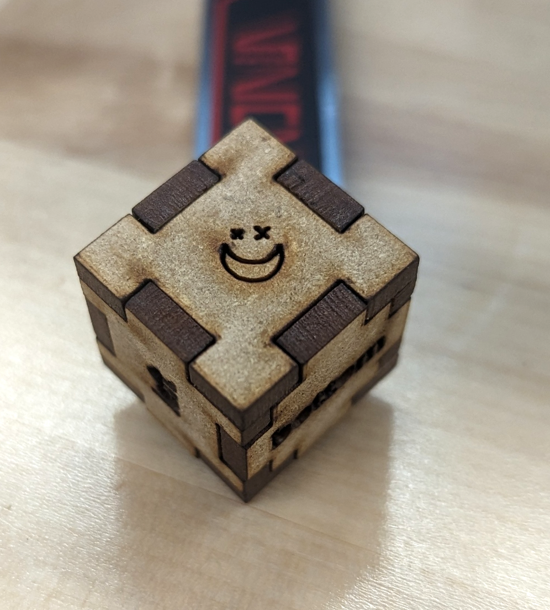

# SEA2024
BME Summer Engineering Academy 2024 Urs Utzinger

Make a fun dice.

## Requirements

### Software
- [Access to Maker Case](https://en.makercase.com/)
- Laser Works to convert your drawing to laser cutter instructions. Windows only. [Download LaserWORKS V8 here](https://bosslaser.com/laser-software/)
- Inkscape to edit and change your drawings. Any Computer. [Obtain it here](https://inkscape.org/release/inkscape-1.2/)or Adobe Illustrator

### Hardware
- One piece of MDF wood particle board. Approximately 1/8 inch thick
- BOSS Laser 2436 or simiar

## Instructions
Find a pieve of MDF board and determine its thickness:
- Meaure the thickness of your MDF board with calipers.
- The calipers need to show 0mm when they are closed
- The measure like this:

Draw a Box
Connect to the website and select:
- Simple box
- Thickness you measured
- Closed box
- Units millimeters
- Finger joints
- Adjust equal dimensions no larger than 50x50x50mm.
- Adjust finger size so that it looks like this:

Create the Plans:
Download the svg file and set the following:
- Kerf and Corner Compensation 0.1mm (you need to cut less because the laser beam has a width)

Update the Plans:
- Load the SVG file with Inkscape on a computer.
- Ungroup the imported graphics with Object/Ungroup
- Replace the text with your own graphics. Forexample: https://www.svgrepo.com/svg/532061/moon-stars. Line Icons work well as the laser just draws the lines. 
- Import the graphics into Inkscape.
- Likely its too large and wont fit. Click on the imported object and select Object/Transform. Scale it proportionally to for example 10%.
- Adjust the Color and Stroke with Object / Fill and Stroke. The Stroke Point should be black (R,G,B is 0). Then the Stroke Stule should be 0.1mm Width.
- Save the modified SVG filed

Convert the SVG file to Laser Cutter Format
- Save the SVG file to DXF. Make sure to use Millimeters as units (mm).
- Open the RDWorksV8.exe program.
- Import the DXF file.
- Make sure its size matches your expectations.
- If it looks ok you can copy the DXF file to a flashdrive. Make sure it has your name in the filename.

## Creating the parts

### Start the Laser
- Toggle the switch on the Table. The airpump needs to viberate, the fan needs to make noise, the chiller needs to show about 22 Centrigrades.
- If all ok start the laser by turning the key (perhaps you also need to turn the emergency button).
- Load your dxf file into RDWorks on the laser cutter computer. Perhaps other peoples parts can be loaded also.

Select all the objects and adjust the cutting properties by clicking on the colors on the top right.
- The cutting color needs to cut with 40mm/s and 95% power
- The text color needs to cut with 350mm/s and 80% power

Select all the objects and click Upload. Give a short filename. Acknowledge Upload.

On the laser push file, select your file. It should look like on the computer screen.

Plase the wood ontop the cutting bed.
Push ESC and then move the cutting head with the arrows to the top right corner of the board. Push Origin.
Push ESC, then Z/U and select autofocus. Let the machine focus.
Push Z/U select Z and make sure it reads about 6mm. Use the left/right arrows to adjust.

Push ESC, the Frame and make sure the object fits onto the board as the laser head draws the outline of all objects. If it does not fit, move the board.

Finally cut the parts with buttom right button.

### Assemble
Put the parts together. 
You can use some white wood glue to make them stick better. But use only small amount and only on the sides that touch other wood.

